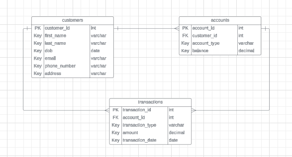

# Tasks 1: Database Design:
# 1.Create the database named "HMBank"
```sql
CREATE DATABASE HMBank
```
```sql
CREATE TABLE Customers (
    customer_id INT PRIMARY KEY,
    first_name VARCHAR(50),
    last_name VARCHAR(50),
    DOB DATE,
    email VARCHAR(100),
    phone_number VARCHAR(20),
    address VARCHAR(255)
);
```

```sql
CREATE TABLE Accounts (
    account_id INT PRIMARY KEY,
    customer_id INT,
    account_type VARCHAR(50),
    balance DECIMAL(10, 2),
    FOREIGN KEY (customer_id) REFERENCES Customers(customer_id)
);
```
```
CREATE TABLE Transactions (
    transaction_id INT PRIMARY KEY,
    account_id INT,
    transaction_type VARCHAR(50),
    amount DECIMAL(10, 2),
    transaction_date DATE,
    FOREIGN KEY (account_id) REFERENCES Accounts(account_id)
);
```


# Tasks 2: Select, Where, Between, AND, LIKE:
#    1.Insert at least 10 sample records into each of the following tables.
• Customers
• Accounts
• Transactions
```sql

INSERT INTO Customers (customer_id, first_name, last_name, DOB, email, phone_number, address)
VALUES
(1, 'John', 'Doe', '1980-05-15', 'john.doe@example.com', '1234567890', '123 Main St, City'),
(2, 'Jane', 'Smith', '1990-08-20', 'jane.smith@example.com', '9876543210', '456 Elm St, Town'),
(3, 'David', 'Johnson', '1975-12-10', 'david.johnson@example.com', '5555555555', '789 Oak St, Village'),
(4, 'Emily', 'Brown', '1988-03-25', 'emily.brown@example.com', '9998887777', '101 Pine St, Hamlet'),
(5, 'Michael', 'Wilson', '1982-11-07', 'michael.wilson@example.com', '1112223333', '202 Maple St, Suburb'),
(6, 'Sarah', 'Taylor', '1995-06-12', 'sarah.taylor@example.com', '7777777777', '303 Cedar St, County'),
(7, 'Daniel', 'Anderson', '1983-09-18', 'daniel.anderson@example.com', '4444444444', '404 Birch St, Borough'),
(8, 'Jessica', 'Martinez', '1979-02-28', 'jessica.martinez@example.com', '6666666666', '505 Oak St, Metropolis'),
(9, 'Christopher', 'Garcia', '1992-07-04', 'christopher.garcia@example.com', '2223334444', '606 Elm St, Township'),
(10, 'Amanda', 'Lopez', '1986-04-30', 'amanda.lopez@example.com', '8889990000', '707 Maple St, District'),
(11, 'Matthew', 'Hernandez', '1980-12-15', 'matthew.hernandez@example.com', '1231231234', '808 Pine St, Village'),
(12, 'Ashley', 'Gonzalez', '1990-10-22', 'ashley.gonzalez@example.com', '5556667777', '909 Cedar St, Hamlet');

INSERT INTO Accounts (account_id, customer_id, account_type, balance)
VALUES
(1, 1, 'savings', 1000.00),
(2, 2, 'current', 500.50),
(3, 3, 'savings', 2000.00),
(4, 4, 'savings', 1500.75),
(5, 5, 'current', 700.25),
(6, 6, 'savings', 3000.00),
(7, 7, 'current', 900.00),
(8, 8, 'savings', 1800.50),
(9, 9, 'current', 1200.00),
(10, 10, 'savings', 2500.00),
(11, 11, 'current', 600.00),
(12, 12, 'savings', 2200.00);

INSERT INTO Transactions (transaction_id, account_id, transaction_type, amount, transaction_date)
VALUES
(1, 1, 'deposit', 500.00, '2024-04-01'),
(2, 1, 'withdrawal', 200.00, '2024-04-05'),
(3, 2, 'deposit', 100.00, '2024-04-02'),
(4, 3, 'withdrawal', 300.00, '2024-04-03'),
(5, 4, 'deposit', 800.00, '2024-04-06'),
(6, 5, 'withdrawal', 200.50, '2024-04-07'),
(7, 6, 'deposit', 1000.00, '2024-04-08'),
(8, 7, 'withdrawal', 400.00, '2024-04-09'),
(9, 8, 'deposit', 700.25, '2024-04-10'),
(10, 9, 'withdrawal', 300.00, '2024-04-11'),
(11, 10, 'deposit', 1500.00, '2024-04-12'),
(12, 11, 'withdrawal', 200.00, '2024-04-13');
```
# 	Create an ERD (Entity Relationship Diagram) for the database.

# 2.Write SQL queries for the following tasks:
1.Write a SQL query to retrieve the name, account type and email of all customers.
```sql
select concat(first_name,' ', last_name) as Name, account_type, email from Customers,Accounts
```
# 2.Write a SQL query to list all transaction corresponding customer.
```sql
SELECT T.*, C.* FROM Transactions T
JOIN  Accounts A ON T.account_id = A.account_id
JOIN Customers C ON A.customer_id = C.customer_id;

  
```

# 3.Write a SQL query to increase the balance of a specific account by a certain amount.
```sql
update Accounts
set balance = balance + 100
where account_id = 3
```
# 4.Write a SQL query to Combine first and last names of customers as a full_name.
```sql
select concat(first_name,' ',last_name) as full_name from Customers
```

# 5.Write a SQL query to remove accounts with a balance of zero where the account type is savings.
```sql
delete from Accounts
where balance = 0 and account_type = 'savings'
``` 

# 6.Write a SQL query to Find customers living in a specific city.
```sql

select * from Customers
where address like '%Hamlet%'
``` 
# 7.Write a SQL query to Get the account balance for a specific account.
```sql
select balance from Accounts
where account_id = 2
``` 
# 8.Write a SQL query to List all current accounts with a balance greater than $1,000.
```sql
select * from Accounts
where account_type = 'savings' and balance > 1000
``` 
# 9.Write a SQL query to Retrieve all transactions for a specific account.
```sql
select * from Transactions
where account_id = 1
``` 
# 10.Write a SQL query to Calculate the interest accrued on savings accounts based on a given interest rate.
```sql
select account_id, balance * 0.08 as interest_accrued from Accounts
where account_type = 'savings'
 ``` 
# 11.Write a SQL query to Identify accounts where the balance is less than a specified overdraft limit.
```sql
DECLARE @overdraft int = 1000;
select * from Accounts
where balance > @overdraft
``` 
# 12.Write a SQL query to Find customers not living in a specific city.
```sql
select * from Customers
where address not like '%Hamlet%'
``` 
# Tasks 3: Aggregate functions, Having, Order By, GroupBy and Joins:

# 1.Write a SQL query to Find the average account balance for all customers.
```sql
select avg(balance) as average_balance from Accounts
``` 
# 2.Write a SQL query to Retrieve the top 10 highest account balances.
```sql
select account_id, balance from Accounts
order by balance desc
OFFSET 0 ROWS
FETCH NEXT 10 ROWS ONLY;
``` 
# 3.Write a SQL query to Calculate Total Deposits for All Customers in specific date.
```sql
select sum(amount) as total_deposit from Transactions
where transaction_type = 'deposit' and transaction_date = '2024-04-02'
``` 
# 4.Write a SQL query to Find the Oldest and Newest Customers.
```sql
select min(dob) as Oldest_customer, max(dob) as newest_customer from Customers
``` 
# 5.Write a SQL query to Retrieve transaction details along with the account type.
```sql
select o.*,i.account_type from Transactions o
join Accounts i on o.account_id = i.account_id
``` 
# 6.Write a SQL query to Get a list of customers along with their account details.
```sql
select o.*,i.* from Customers o
join Accounts i on o.customer_id = i.customer_id
``` 
# 7.Write a SQL query to Retrieve transaction details along with customer information for a specific account.
```sql
select t.*,o.* from Customers o
join Accounts i on o.customer_id = i.customer_id
join Transactions t on i.account_id = t.account_id
where t.account_id = 1
``` 
# 8.Write a SQL query to Identify customers who have more than one account.
```sql
INSERT INTO Accounts (account_id, customer_id, account_type, balance)
VALUES(13,1,'current',2500)


select customer_id from Accounts
group by customer_id
having count(customer_id) > 1
``` 
# 9.Write a SQL query to Calculate the difference in transaction amounts between deposits and withdrawals.
```sql
select sum(amount) - (select sum(amount) from Transactions
where transaction_type = 'withdrawal') as [difference in transaction amounts] from Transactions
where transaction_type = 'deposit'
``` 
# 10.Write a SQL query to Calculate the average daily balance for each account over a specified period.
```sql
SELECT account_id,AVG(Daily_Balance) AS AverageDailyBalance
FROM 
    (SELECT account_id,transaction_date,
	SUM(Amount) OVER (PARTITION BY Account_ID, CAST(Transaction_Date AS DATE)) AS Daily_Balance
    FROM Transactions
    WHERE transaction_date BETWEEN '2024-04-01' AND '2024-04-11') AS Daily_Balances
	GROUP BY account_id;

	``` 

# 11.Calculate the total balance for each account type.
```sql
select account_type,sum(balance) as [total balance]  from Accounts
group by account_type
``` 
# 12.	Identify accounts with the highest number of transactions order by descending order.
```sql
select account_id, count(transaction_id) as [number of transactions] from Transactions
group by account_id 
order by [number of transactions] desc
``` 
# 13.List customers with high aggregate account balances, along with their account types.
```sql
select c.first_name,c.last_name,sum(a.balance) as aggregate_balance,a.account_type from Customers as c 
join Accounts as a on c.customer_id =  a.customer_id 
group by c.first_name,c.last_name,a.balance ,a.account_type
order by a.balance desc;
``` 
# 14.Identify and list duplicate transactions based on transaction amount, date, and account.
```sql
select amount,transaction_date,account_id,COUNT(*) as DuplicateCount from Transactions
group by amount,transaction_date,account_id
having count(*) > 1;
``` 
# Tasks 4: Subquery and its type:
# 1.	Retrieve the customer(s) with the highest account balance.
```sql
select a.first_name,a.last_name,b.balance from Customers a
join accounts b on a.customer_id = b.customer_id
where a.customer_id = (select customer_id from Accounts
order by balance desc
offset 0 rows
fetch next 1 rows only)
``` 
# 2.Calculate the average account balance for customers who have more than one account.
```sql 
select avg(balance) as average_balance from Accounts
where customer_id = (select customer_id from Accounts
group by customer_id
having count(customer_id) > 1)
``` 
# 3.Retrieve accounts with transactions whose amounts exceed the average transaction amount.
```sql
select * from Accounts
where account_id in (select account_id from Transactions
where amount > (select avg(amount) from Transactions))
``` 
# 4.Identify customers who have no recorded transactions.
```sql
select customer_id, first_name, last_name from Customers
where customer_id in (select customer_id from Accounts
where account_id not in (select account_id from Transactions))
``` 
# 5.Calculate the total balance of accounts with no recorded transactions.
```sql
select sum(balance) as total_balance from Accounts
where account_id not in (select account_id from Transactions)
``` 

# 6.Retrieve transactions for accounts with the lowest balance.
```sql
select * from Transactions
where account_id = (select account_id from Accounts
where balance = (select min(balance) from Accounts))
``` 
# 7.Identify customers who have accounts of multiple types.
```sql
select * from Customers
where customer_id in (select customer_id from Accounts
group by customer_id
having count(customer_id) > 1)
``` 
# 8.Calculate the percentage of each account type out of the total number of accounts.
```sql
SELECT account_type,COUNT(*) AS AccountTypeCount,CAST(COUNT(*) * 100.0 / (SELECT COUNT(*) FROM Accounts) AS DECIMAL(10,2)) AS Percentage
FROM Accounts
GROUP BY account_type;
``` 
# 9.Retrieve all transactions for a customer with a given customer_id.
```sql
select * from Transactions
where account_id in (select account_id from Accounts
where customer_id = 1)
``` 
# 10.	Calculate the total balance for each account type, including a subquery within the SELECT clause.
```sql
SELECT  Account_Type,(SELECT SUM(Balance) FROM Accounts WHERE account_type = a.account_type) AS TotalBalance
FROM  (SELECT DISTINCT account_type FROM Accounts) AS a;
``` 